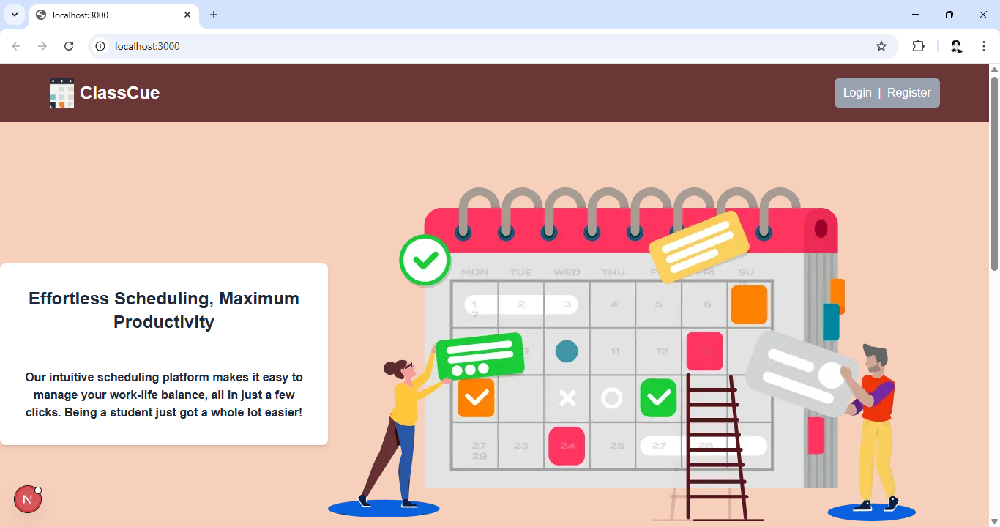
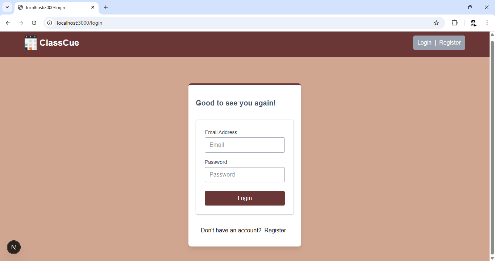
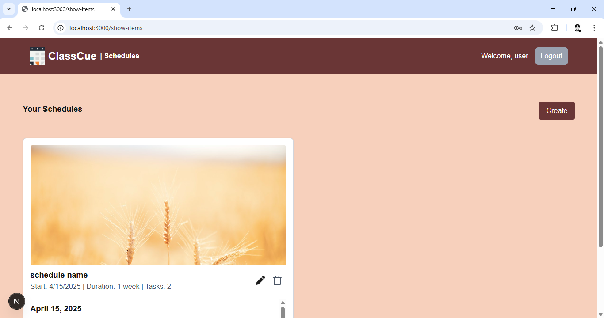
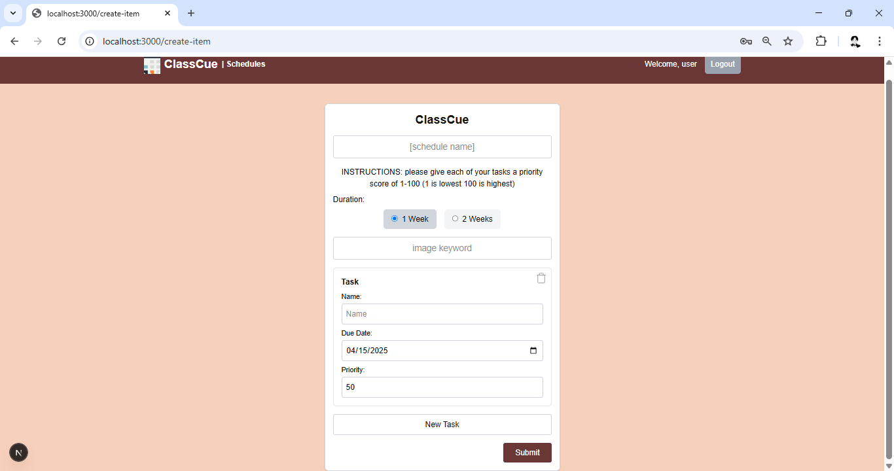

# DevDawgs-Project

## Team Name and Members
- Awad, Susan: https://github.com/Susan-Awad
- Mutongi, Michael: https://github.com/mem23074
- Patel, Jaisal: https://github.com/jaip1127
- Runckel, David: https://github.com/DavidRunckel
  
## Project Description
ClassCue is a web application built for students to manage their busy schedules. Users can create schedules and fill them with any number of tasks, each with due dates and a level of importance. Below are the four core pages and their functionality.

_____________________________________
**Splash Page:** 
The splash page is the page displayed on initial load. Treated as the homepage and houses our pitch to new users, along with sample schedules to showcase what the user's schedule will look like. The user can login or register for ClassCue from this page by selecting the "login | register" button.

_____________________________________
**Login/Signup Page:** 
The login/signup page is where the user can log in to ClassCue to access the authenticated view page or register if they don't have an account. When the user signs up, their information is stored in a MongoDB database with their password hashed with bcrypt. The user logs in by filling in their email and password, which is compared to the information stored under the same email in the database. Once authenticated, the user is redirected to the authenticated view page. Once logged in, this button transforms into a log out button, which can be pressed to log out the user from ClassCue.

_____________________________________
**Authenticated View Page:**
After the user logs in, they are redirected to this page. This is where authenticated users can create new schedules or view, edit, and delete their created schedules. The navigation bar is updated once logged in to display a welcome message and provide a link to this page if the user finds themselves needing to return. To create a new schedule, the user can select the "create" button or the "create new schedule" button. Both buttons redirect the user to the add schedule page. The user can view all their tasks in a schedule by scrolling inside each schedule card. To edit or delete a schedule, the user will press the pencil or trash icon, respectively. Each authenticated view is unique to each user, and no user will see another user's schedules.

_____________________________________
**Add Schedule Page:** 
This form can be filled to create a new schedule for the user, which is displayed on the authenticated view page. The user fills in the schedule name, duration of the schedule, image keyword (needed to generate an image from Unsplash API), and an infinite number of tasks created with the "new task" button. Each task has a name, due date, and priority, which is used to order the tasks in the schedule. To delete a task, the user can click the trash icon. Once everything in the form is filled to the user's satisfaction, they can submit the form, creating a new schedule. Each new schedule is unique to the user and is stored in each user object.

